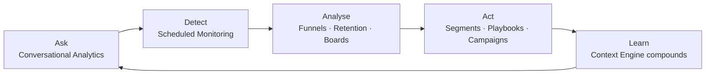

# Core Concepts

Actioneer's capabilities fall into four patterns — each built on top of the Context Engine and Agent Orchestration Runtime. Alongside these, the platform includes purpose-built features for ongoing analysis and monitoring.

---

## Capability Patterns

| &nbsp; Pattern | &nbsp; What it does | &nbsp; Key outcome |
| :--- | :--- | :--- |
| &nbsp; **Conversational Analytics** | &nbsp; Plain-language access to data, grounded in governed definitions | &nbsp; 3-day analyst requests answered in the same conversation |
| &nbsp; **Playbooks** | &nbsp; Multi-step workflows and scheduled monitoring — analysis, decision, and action | &nbsp; Weeks of analyst effort on autopilot, anomalies caught before they compound |
| &nbsp; **Custom Agents** | &nbsp; Bespoke agentic capabilities built to the shape of your organisation | &nbsp; Variance commentary, reconciliation, exception handling — governed and observable |

---

## Platform Features

| &nbsp; Feature | &nbsp; Type | &nbsp; Purpose |
| :--- | :--- | :--- |
| &nbsp; **Boards** | &nbsp; Visualisation | &nbsp; Persistent pages of charts, tables, and metrics for ongoing monitoring |
| &nbsp; **Segments** | &nbsp; Audience + Action | &nbsp; Rule-based user groups — defined by behaviour, pushed to CLM tools |
| &nbsp; **Funnels** | &nbsp; Analysis | &nbsp; Step-by-step conversion tracking with drop-off diagnosis |
| &nbsp; **Retention** | &nbsp; Analysis | &nbsp; Cohort-based retention tracking across time windows and segments |
| &nbsp; **Metrics** | &nbsp; Data Catalog | &nbsp; Governed metric definitions, SQL logic, and the data catalog |
| &nbsp; **Knowledge** | &nbsp; Context | &nbsp; Institutional knowledge that sharpens every AI answer |

---

## How They Connect

<Tip>Every interaction feeds back into the Context Engine. The platform gets sharper with use.</Tip>

---

## Use Cases by Buyer Function

<Tabs>
  <Tab title="Growth" icon="trending-up">
    | Problem | Capability Pattern |
    | :--- | :--- |
    | Can't answer growth questions same-day — data scattered across product / ads / CRM / messaging | Conversational Analytics |
    | Don't know which cohorts to target with which messaging | Conversational Analytics + Playbooks |
    | Funnel performance is opaque — can't isolate where users drop and why | Conversational Analytics (Funnel parity) |
    | Retention diagnosis requires the data team and takes weeks | Custom Agent: retention diagnostic |
    | Performance marketing spend partially wasted but the team can't say where | Playbooks + Custom analysis |
    | Cross-sell opportunities exist but the messaging stack doesn't reach them | Playbooks (triggered messaging) |
  </Tab>
  <Tab title="Retention" icon="refresh-cw">
    | Problem | Capability Pattern |
    | :--- | :--- |
    | Don't know who's about to churn or why | Custom Agent: churn diagnostic + Playbook |
    | Lifecycle has too many touchpoints to instrument manually | Playbooks across the lifecycle |
    | KYC / activation drop-off is invisible | Playbook surfacing the funnel drop and reasoning |
    | Re-engagement campaigns are generic when they should be cohort-specific | Playbooks (cohort-specific messaging) |
  </Tab>
  <Tab title="Operations" icon="settings">
    | Problem | Capability Pattern |
    | :--- | :--- |
    | Supplier/vendor risk visible too late, after damage done | Playbook ranked by customer impact |
    | Exception handling eats the day | Playbook + Custom Agent for triage |
    | Production schedule slippage is reactive, not proactive | Playbook (monitoring + action) |
    | Cross-system reconciliation (ERP / CRM / billing) is manual | Custom Agent: continuous reconciliation |
  </Tab>
  <Tab title="Finance / FP&A" icon="calculator">
    | Problem | Capability Pattern |
    | :--- | :--- |
    | Variance commentary eats the team every period | Custom Agent: variance commentary + drivers |
    | Board-pack prep is a fire drill | Custom Agent: board variance pack |
    | Period close requires cross-system reconciliation done by hand | Custom Agent: period close assistant |
    | Forecast accuracy is unknown until it's wrong | Playbook: forecast accuracy diagnostic |
  </Tab>
</Tabs>

---

## Explore

<CardGroup cols={2}>
  <Card title="Conversational Analytics" icon="message-square" href="/about/core-concepts/conversational-analytics">
    Plain-language data access grounded in your definitions.
  </Card>
  <Card title="Playbooks" icon="book-open" href="/about/core-concepts/playbooks">
    Multi-step workflows and scheduled monitoring — built once, run automatically.
  </Card>
  <Card title="Custom Agents" icon="zap" href="/about/core-concepts/custom-agents">
    Bespoke agentic capabilities for your organisation.
  </Card>
  <Card title="Boards" icon="layout-dashboard" href="/about/core-concepts/boards">
    Persistent dashboards built through conversation.
  </Card>
</CardGroup>

<CardGroup cols={2}>
  <Card title="Segments" icon="users" href="/about/core-concepts/segments">
    Audience groups with one-click push to CLM tools.
  </Card>
  <Card title="Funnels" icon="git-branch" href="/about/core-concepts/funnels">
    Step-by-step conversion tracking.
  </Card>
  <Card title="Retention" icon="refresh-cw" href="/about/core-concepts/retention">
    Cohort-based retention analysis.
  </Card>
</CardGroup>

<CardGroup cols={2}>
  <Card title="Metrics" icon="gauge" href="/about/core-concepts/metrics">
    Governed metric definitions and the data catalog.
  </Card>
  <Card title="Knowledge" icon="brain" href="/about/core-concepts/knowledge">
    Institutional knowledge that sharpens every AI answer.
  </Card>
</CardGroup>

<Card title="Next: Getting Started" icon="rocket" horizontal href="/about/getting-started">
  Set up your account and ship the first capability.
</Card>
