`distinct_id` is the resolution key for all attribution. **Getting identity right is the single most consequential part of the integration** — mismanaging it either fragments one user across many profiles (under-merged) or collides several users into one (over-merged).

A meaningful share of traffic is typically pre-login and carries no stable user ID. Persisting a stable anonymous identifier and emitting `$identify` at login is essential to keep those users from fragmenting.

<Warning>
  Identity continuity is the client's responsibility — no SDK does Actioneer's merge for you. If you skip the anonymous-ID-to-login stitch, pre-login events fragment into separate users and funnel and conversion metrics undercount.
</Warning>

## Lifecycle

```mermaid
%%{init: {'theme':'base','themeVariables':{'actorBkg':'#242a1c','actorBorder':'#6b7a4f','actorTextColor':'#e8ebe0','actorLineColor':'#4b5563','signalColor':'#9ca3af','signalTextColor':'#cdd2c2','noteBkgColor':'#4a5439','noteTextColor':'#eef1e6','noteBorderColor':'#6b7a4f','sequenceNumberColor':'#eef1e6','lineColor':'#6b7a4f'}}}%%
sequenceDiagram
    autonumber
    participant App as App / SDK
    participant API as Actioneer Ingestion
    participant Profile as User Profile

    rect rgb(35, 34, 27)
    Note over App,Profile: Pre-login · anonymous
    App->>API: event · distinct_id = anon-9f2c
    API->>Profile: attribute to anon-9f2c
    end

    rect rgb(28, 33, 23)
    Note over App,Profile: Login / signup · $identify
    App->>API: $identify · distinct_id = user_8a31f0c2 · $anon_distinct_id = anon-9f2c
    API->>Profile: merge anon-9f2c into user_8a31f0c2
    Note over App,Profile: Post-login · identified
    App->>API: event · distinct_id = user_8a31f0c2
    API->>Profile: attribute to user_8a31f0c2
    end
```



| Phase | `distinct_id` |
| :--- | :--- |
| Pre-login (anonymous) | A stable anonymous identifier generated and persisted by the client. Must persist across the anonymous session. |
| At login / signup | Emit `$identify` with `distinct_id` = the authenticated user ID and `$anon_distinct_id` = the prior anonymous identifier. |
| Post-login | The authenticated user ID, for all subsequent events. |

**Identifier shapes**

- Post-login `distinct_id` = your application's stable user ID.
- Pre-login `distinct_id` = the stable anonymous identifier the client persists (e.g. a device-scoped or first-touch UUID).

## $identify

`$identify` links a prior identifier to the current `distinct_id`. The prior identifier may be an anonymous ID, a device ID, or a legacy user ID.

```json
{
  "event_id": "identify-user_8a31f0c2",
  "event": "$identify",
  "distinct_id": "user_8a31f0c2",
  "timestamp": "2026-06-04T06:31:00.000Z",
  "properties": {
    "$anon_distinct_id": "anon-9f2c",
    "$set": { "isPremiumUser": true },
    "$set_once": { "first_seen_source": "google" }
  }
}
```

- `distinct_id` — the surviving (current) identity.
- `$anon_distinct_id` — the identity to be merged into it.
- Profile operators may accompany the merge in the same call. See [Property Taxonomy](/ingestion/properties).
